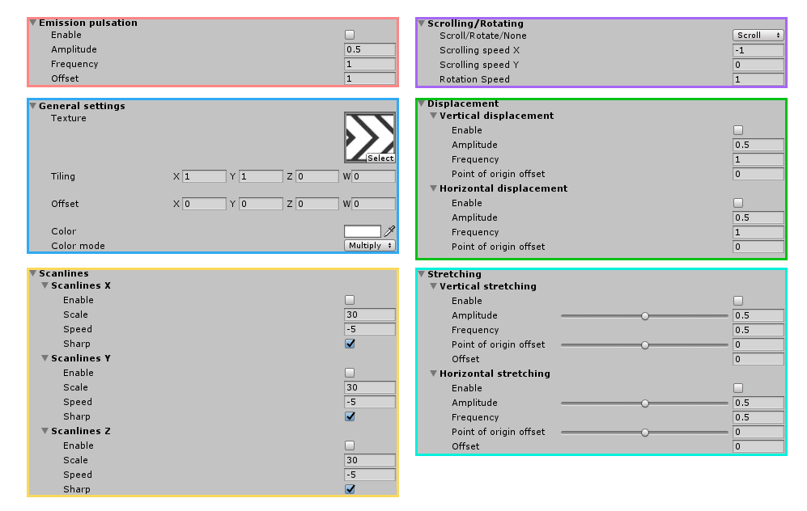

# TexturePanner  

This shader is a glorified texture panner, with a few extra features oriented towards adding variety. By getting creative with mesh geometry and textures, we can achieve a wide range of results.

It can be edited through [Amplify Shader Editor](http://amplify.pt/unity/amplify-shader-editor) and contributions to the project are always welcome!

Project developed using **Unity 2017.4.8f1**. Please use this version if you are planning on contributing.

_(Beware: The screenshots folder is quite heavy at the moment, I need to find a way to reduce file size for gifs without losing too much quality)_

# Table of contents
1. [Setup](#setup)
   - 1.1 [Getting started](#getting-started)
   - 1.2 [Using your own meshes](#using-your-own-meshes)
2. [Usage & parameters](#usage-parameters)
   - 2.1 [General settings](#general-settings)
   - 2.2 [Scrolling & rotation](#scrollingrotation)
   - 2.3 [Scanlines](#scanlines)
   - 2.4 [Stretching](#stretching)
   - 2.5 [Displacement](#displacement)
3. [Examples](#examples)
4. [License](#license)

# Setup
## Getting started
The setup for this shader is minimal, all you need to do is create a new material and assign a base texture, which will be scrolled over the UVs. Assign this new material to a quad and there we go, we now have a scrolling texture:

  

When using textures that allow transparency (.png for instance), this information is taken into consideration.

## Using your own meshes

A series of meshes ready to use are included within this repository, but depending on your project, you will most likely have the need to use meshes other than these. In this case, we need to be mindful of the UVs.

If we use the default cube mesh in Unity as our mesh, the texture we chose will scroll over every face:

  

Furthermore, we can see both side faces are going against each other, thus breaking the scrolling effect. We need to lay out the UVs of our mesh in a way that allows for easy scrolling. For instance, if our goal is to make the arrows loop through the side faces of the cube, we need to get rid of the top and bottom faces, and orient all the side faces in the same direction.

It is recommended to layout all the faces inside the UV square for cleaner results. This means our texture will stretch across all the faces, which me may not want, but we can always tile it in the inspector:

  

# Usage, parameters

**WIP**

This shader is comprised of a few "modules", that work independently and can be activated/deactivated without affecting each other.

## General settings

Texture tiling, offset and color mixing fall under this category. Color mixing offers a few options:
- `Original`: The original color of the texture is respected, no action is taken.
- `Hueshift`: The hue value of the texture is shifted by the hue value of the selected color.
- `Multiply`: Direct multiplication of both colors.
- `Replace`: Gives a new color to the whole texture.

## Scrolling/Rotation

This module is the core of this shader. It allows you to **scroll** the texture in both axes, with independent speed values.

As an alternative, it is also possible to **rotate** the texture instead of scrolling it. In this case, it is advised to set the texture's wrap mode to `Clamp` instead of `Repeat`, otherwise, copies of the texture will sometimes bleed in through corners.

It is also possible to disable both of these modes. This is useful in case we just want some scanlines scrolling through a static texture.

## Scanlines

Allows you to simulate transparent scanlines looping through the texture. By ticking/unticking the `Sharp` option, we can get a slightly different look.

## Stretching

By manipulating the vertices of the mesh we can make it stretch along the horizontal and the vertical axes. `Amplitude offset` comes in handy if you don't want the texture to ever reach a value of 0, and the `Origin offset` parameter allows you to offset the anchor point for the stretching.

## Displacement

Very similar to the previous concept, it allows for a displacement of the whole mesh.

# Examples

3D space loading rings are a great application for scrolling textures, since you can easily create unique-looking pieces.

Conveyor belts are the prime example for texture scrolling, since they illustrate the concept perfectly.

A slightly different version of the shader (TexturePanner_opaque) is used for these ones, which can cast and receive shadows.

Texture panning is a simple concept that we can take advantage of to create a huge variety of effects.

We are just simply scrolling said texture over a mesh, but the results we can achieve are really diverse.

By stretching the mesh and scrolling the texture at high speeds, we get a twitchy behaviour, resembling the appearance of spaceship thrusters.

Given the appropriate mesh and UV setup, this shader can be used to achieve that futuristic cyberpunk neon ad look, including scanlines.

Also, _A E S T H E T I C_.

Imagination is the limit!

Experiment with new geometries and effect combinations. Sometimes the most fun outcomes are the result of just toying around!

# License
MIT License

Copyright (c) 2018 Guillermo Angel

Permission is hereby granted, free of charge, to any person obtaining a copy
of this software and associated documentation files (the "Software"), to deal
in the Software without restriction, including without limitation the rights
to use, copy, modify, merge, publish, distribute, sublicense, and/or sell
copies of the Software, and to permit persons to whom the Software is
furnished to do so, subject to the following conditions:

The above copyright notice and this permission notice shall be included in all
copies or substantial portions of the Software.

THE SOFTWARE IS PROVIDED "AS IS", WITHOUT WARRANTY OF ANY KIND, EXPRESS OR
IMPLIED, INCLUDING BUT NOT LIMITED TO THE WARRANTIES OF MERCHANTABILITY,
FITNESS FOR A PARTICULAR PURPOSE AND NONINFRINGEMENT. IN NO EVENT SHALL THE
AUTHORS OR COPYRIGHT HOLDERS BE LIABLE FOR ANY CLAIM, DAMAGES OR OTHER
LIABILITY, WHETHER IN AN ACTION OF CONTRACT, TORT OR OTHERWISE, ARISING FROM,
OUT OF OR IN CONNECTION WITH THE SOFTWARE OR THE USE OR OTHER DEALINGS IN THE
SOFTWARE.
