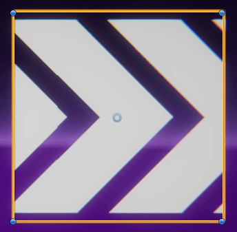
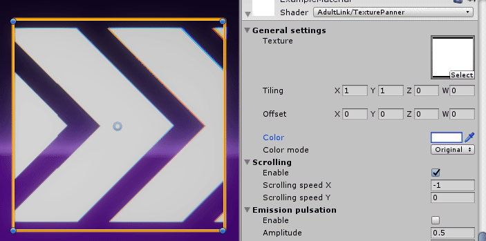
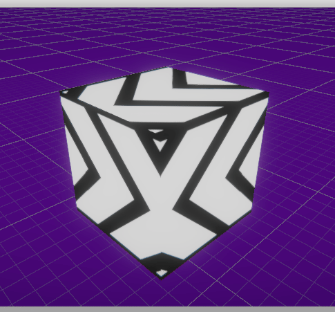
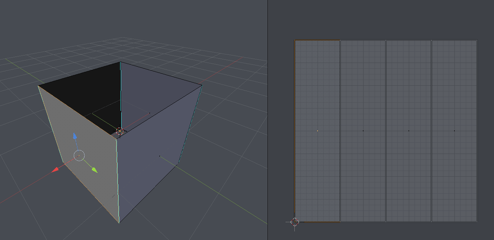

# TexturePanner  

This shader is a glorified texture panner, with a few extra features oriented towards adding variety. It can be modified through [Amplify Shader Editor](http://amplify.pt/unity/amplify-shader-editor) and contributions to the project are always welcome!
## Setup
### Getting started
The setup for this shader is minimal, all you need to do is create a new material and assign a base texture, which will be scrolled over the UVs. Assign this new material to a quad and there we go, we now have a scrolling texture:

When using textures that allow transparency (.png for instance), this information is taken into consideration:

### Using your own meshes

Depending on your project, you will most have likely have the need to use meshes other than a quad. In this case, we need to be mindful of the UVs. If we use the default cube mesh in Unity as our mesh, the texture we chose will scroll over every face:

Furthermore, we can see both side faces are going against each other, thus breaking the scrolling effect. We need to lay out the UVs of our mesh in a way that allows for easy scrolling. For instance, if our goal is to make the arrows loop through the side faces of the cube, we need to get rid of the top and bottom faces, and orient all the side faces in the same direction.

It is recommended to layout all the faces inside the UV square for cleaner results. This means our texture will stretch across all the faces, which me may not want, but we can always tile it in the inspector:

## Examples

## Usage, parameters
## License
MIT License

Copyright (c) 2018 Guillermo Angel

Permission is hereby granted, free of charge, to any person obtaining a copy
of this software and associated documentation files (the "Software"), to deal
in the Software without restriction, including without limitation the rights
to use, copy, modify, merge, publish, distribute, sublicense, and/or sell
copies of the Software, and to permit persons to whom the Software is
furnished to do so, subject to the following conditions:

The above copyright notice and this permission notice shall be included in all
copies or substantial portions of the Software.

THE SOFTWARE IS PROVIDED "AS IS", WITHOUT WARRANTY OF ANY KIND, EXPRESS OR
IMPLIED, INCLUDING BUT NOT LIMITED TO THE WARRANTIES OF MERCHANTABILITY,
FITNESS FOR A PARTICULAR PURPOSE AND NONINFRINGEMENT. IN NO EVENT SHALL THE
AUTHORS OR COPYRIGHT HOLDERS BE LIABLE FOR ANY CLAIM, DAMAGES OR OTHER
LIABILITY, WHETHER IN AN ACTION OF CONTRACT, TORT OR OTHERWISE, ARISING FROM,
OUT OF OR IN CONNECTION WITH THE SOFTWARE OR THE USE OR OTHER DEALINGS IN THE
SOFTWARE.
